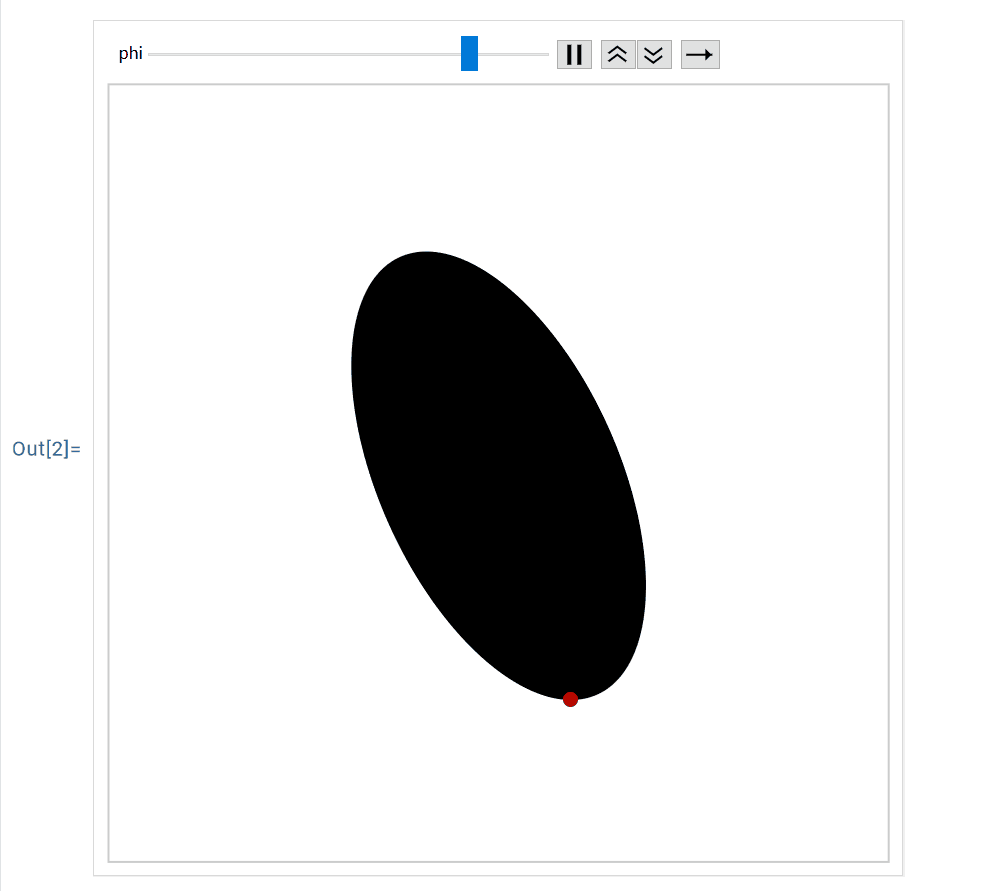
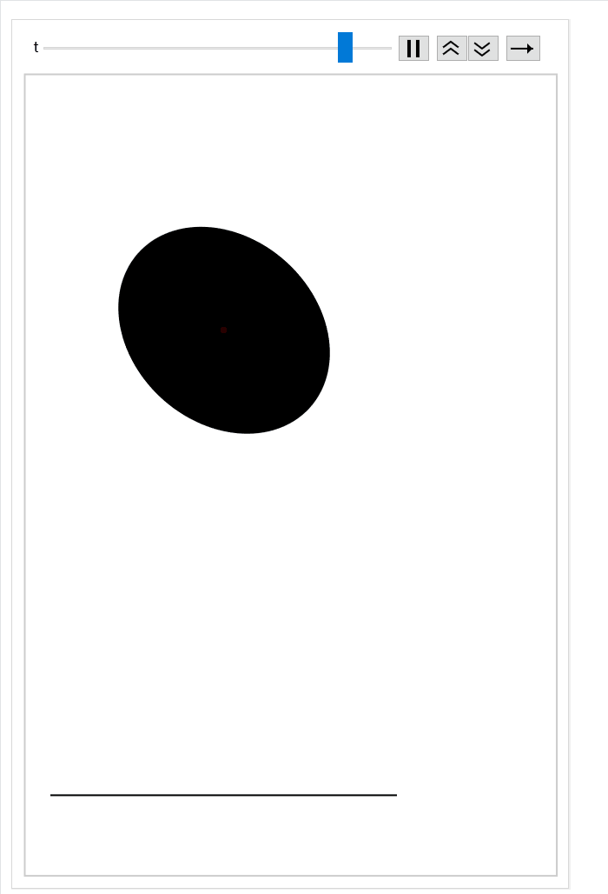

# Numerical and symbolic computations for bouncing convex bodies
Numerical and symbolic computations for the paper: Xiaoming Zhang, Integrability and chaos in the bouncing convex body model. 2025.

## Verification of the formulas of the lowest point when rotating the ellipse and the eccentricity disk:
Mathematica code for ellipse:
```mathematica
With[{a = 2, b = 1},
 Animate[
  Graphics[{Rotate[Disk[{0, 0}, {a, b}], phi], Red, PointSize[Large], 
    Point[{((-a^2 + b^2)  Cos[phi]  Sin[phi])/Sqrt[
      b^2  Cos[phi]^2 + a^2  Sin[phi]^2], -Sqrt[
       b^2  Cos[phi]^2 + a^2  Sin[phi]^2]}]}, 
   PlotRange -> {{-3, 3}, {-3, 3}}], {phi, 0, 2 Pi}]]
```




Mathematica code for eccentricity disk:

```mathematica
With[{r = 2, c = 1},
 Animate[
  Graphics[{Rotate[Circle[{c, 0}, r], phi, {0, 0}], Black, 
    PointSize[Large], Point[{0, 0}], 
    Rotate[Point[{c, 0}], phi, {0, 0}], Red, PointSize[Large], 
    Point[{c  Cos[phi], -r + c  Sin[phi]}]}, 
   PlotRange -> {{-4, 4}, {-4, 4}}], {phi, 0, 2 Pi}]]
```


Numerical simulations for bouncing ellipse:
```mathematica
ClearAll["Global`*"];
m = 10; a = 2; b = 1.6; g = 10;
J = 1/4  (a^2 + b^2)  m;
G1[phi_] := ((-a^2 + b^2)  Cos[phi]  Sin[phi])/Sqrt[
  b^2  Cos[phi]^2 + a^2  Sin[phi]^2];
G2[phi_] := Sqrt[b^2  Cos[phi]^2 + a^2  Sin[phi]^2];
(*impact condition*)
H[y_, phi_] := y - G2[phi];
(*impact rule*)
impactrule[v0_, omega0_, 
   phi0_] := {(G1[phi0]^2  m  v0 - J  (v0 + 2  G1[phi0]  omega0))/(J +
       G1[phi0]^2  m), (J  omega0 - 
      G1[phi0]  m  (2  v0 + G1[phi0]  omega0))/(J + G1[phi0]^2  m)};
vy0 = 0; omega0 = 0;
phi0 = 0.1;
e = 830;
y0 = (2 e - (vy0)^2 m - J  omega0^2)/(2 g m);
sol = NDSolve[{y''[t] == -g, phi''[t] == 0, y[0] == y0, y'[0] == vy0, 
     phi[0] == phi0, phi'[0] == omega0,
     WhenEvent[
      H[y[t], phi[t]] == 0, {state1 = y'[t]; 
       state2 = phi'[t], {y'[t], phi'[t]} -> 
        impactrule[state1, state2, phi[t]]}]}, {y, phi}, {t, 0, 100}, 
    MaxStepSize -> 0.01][[1]];
Animate[Graphics[{Black, Rotate[Disk[{0, y[t]}, {a, b}], phi[t]], Red,
     Point[{0, y[t]}], Black, Line[{{-3, 0}, {3, 0}}]}, 
   PlotRange -> {{-3, 3}, {-1, 12}}] /. sol, {t, 0, 30}]
```


## Symbolic computation for $h_{12}$ and $h_{22}(\phi_{i-1},\phi_{i})+h_{11}(\phi_{i},\phi_{i+1})$

Mathematica code:
```mathematica
ClearAll["Global`*"];
(*The terms A, B, C in the paper*)
A = 1/4 m g^2;
B[phi0_, phi1_] := 2 e - m  g (G[phi0] + G[phi1]);
CC[phi0_, phi1_] := m (G[phi1] - G[phi0])^2 + J  (phi1 - phi0);
(*Denote the time t^* as T[phi0,phi1]*)
(*The solution y and phi*)
y[t_, phi0_, 
   phi1_] := -1/
    2 g  t^2 + ((G[phi1] - G[phi0])/T[phi0, phi1] + 
      1/2 g  T[phi0, phi1])*t + G[phi0];
phi[t_, phi0_, phi1_] := phi0 + (phi1 - phi0)/T[phi0, phi1]*t;
(*Define the generating function*)
h[phi0_, phi1_, e_] = 
 Integrate[
    1/2 m*(D[y[t, phi0, phi1], t])^2 + 
     1/2 J*(D[phi[t, phi0, phi1], t])^2 - m  g  y[t, phi0, phi1], {t, 
     0, T[phi0, phi1]}] + e  T[phi0, phi1] // FullSimplify
(*Define t^* as T[phi0,phi1]*)
T[phi0_, phi1_] := Sqrt[(
  B[phi0, phi1] + Sqrt[B[phi0, phi1]^2 - 4  A  CC[phi0, phi1]])/(2 A)]
  ;
(*Main terms for h12*)
Simplify[
 Series[D[h[phi0, phi1, e], phi0, phi1], {e, 
   Infinity, 2}], Assumptions -> e > 0 && g > 0 && m > 0 && J > 0]
(*Main terms for h22+h11*)
Simplify[
 Series[D[h[phi0, phi1, e] + h[phi1, phi2, e], phi1, phi1], {e, 
   Infinity, 2}], Assumptions -> e > 0 && g > 0 && m > 0 && J > 0]
```
